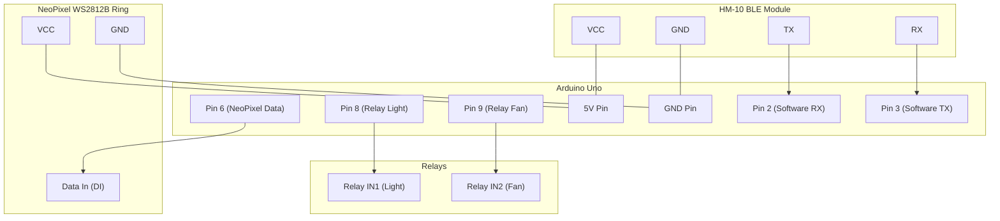

# Smart Home BLE Controller 📱💡

A modern, feature-rich cross-platform Flutter application to control an Arduino-based Smart Home system via **HM-10 Bluetooth Low Energy (BLE)**.

This repository contains both the **Flutter Mobile App** codebase and the **Arduino Controller Sketch** to help you build and automate your own smart home system.

---

## 🚀 Key Features

*   **🔌 Fast BLE Connection**: Instantly scan and connect to HM-10 Bluetooth Low Energy modules with real-time connection status monitoring.
*   **💡 Appliance Control**: Toggle high-voltage appliances like lights and fans via a relay interface.
*   **🌈 WS2812B NeoPixel Ring Controller**:
    *   **Color Presets**: 10 pre-defined quick-access colors.
    *   **RGB Customizer**: Fine-tune custom colors using precise Red, Green, and Blue sliders.
    *   **Brightness Dimmer**: Adjust the lighting intensity dynamically (0-255).
    *   **Dynamic Lighting Effects**: Start non-blocking effects like *Rain*, *Breath*, *Police*, *Fire*, and *Party*.
*   **🎙️ Multi-Language Voice Control**: Native Speech-to-Text command execution.
    *   Supports **English**, **Turkish**, and **Arabic** out of the box.
    *   Editable voice phrase-to-command mappings inside settings.
*   **📅 Smart Scheduling**: Set up one-time or recurring tasks to trigger commands (e.g., turn off lights at 11:00 PM) with Android local notification alerts.
*   **📜 Operations Command Log**: Chronological logging of all sent commands, including their execution source (Button, Voice, or Schedule) and success status.

---

## 🛠️ Hardware Requirements & Wiring

To build this smart home project, you will need the following hardware components:

1.  **Arduino Uno** (or compatible board)
2.  **HM-10 BLE Bluetooth Module** (Bluetooth 4.0)
3.  **WS2812B NeoPixel LED Ring** (16 Pixels)
4.  **2-Channel Relay Module** (or 4-Channel configured for Light/Fan)

### 📌 Pin Connection Table

| Component | Component Pin | Arduino Uno Pin | Notes |
| :--- | :--- | :--- | :--- |
| **HM-10 BLE** | VCC | 5V | Power supply |
| | GND | GND | Ground |
| | TX | Pin 2 (RX) | SoftwareSerial RX |
| | RX | Pin 3 (TX) | SoftwareSerial TX |
| **NeoPixel Ring** | VCC | 5V | Power supply |
| | GND | GND | Ground |
| | DI (Data In) | Pin 6 | PWM Data line |
| **Relay Module** | VCC | 5V | Power supply |
| | GND | GND | Ground |
| | IN1 | Pin 8 | Controls **Light** |
| | IN2 | Pin 9 | Controls **Fan** |

### 🔌 Schematic Diagram



---

## 📡 Serial Command Protocol

The Flutter app communicates with the Arduino by sending newline-terminated (`\n`) lowercase text commands.

| Command Group | Command String | Arduino Action Description |
| :--- | :--- | :--- |
| **Relays** | `light on` / `light off` | Turn the light relay ON or OFF |
| | `fan on` / `fan off` | Turn the fan relay ON or OFF |
| | `all on` / `all off` | Turn both relays and NeoPixel ring ON or OFF |
| **NeoPixel Colors** | `red`, `green`, `blue`, `white`, `yellow`, `purple`, `orange`, `pink`, `cyan`, `magenta` | Stop current effect and set solid color preset |
| **Custom RGB** | `rgb <R> <G> <B>` (e.g., `rgb 255 120 0`) | Stop current effect and set exact custom RGB values |
| **Brightness** | `bright <val>` (e.g., `bright 120`) | Adjust NeoPixel brightness (0 to 255) |
| **Effects** | `rain`, `breath`, `police`, `fire`, `party` | Start non-blocking color pattern animation loops |
| | `stop` | Pause active effect and restore last solid color |
| | `neon off` | Turn off all NeoPixels |

---

## ⚙️ Project Setup & Installation

### 1. Arduino Firmware Setup

1.  Open the Arduino IDE.
2.  Install the **Adafruit NeoPixel** library: Go to `Sketch -> Include Library -> Manage Libraries...`, search for `Adafruit NeoPixel`, and click **Install**.
3.  Open the sketch file: [SmartHome_HM10.ino](file:///c:/Users/HAK/Desktop/Robotik/SmartHomeApp/arduino/SmartHome_HM10/SmartHome_HM10.ino).
4.  Connect your Arduino Uno to your PC via USB.
5.  Select the correct board and COM port in Arduino IDE, then click **Upload**.

### 2. Flutter Mobile App Setup

#### Prerequisites
*   [Flutter SDK](https://docs.flutter.dev/get-started/install) installed (version `>=3.0.0 <4.0.0`)
*   Android Studio or VS Code with Dart & Flutter extensions
*   A physical Android device (BLE scanning does not work on emulators)

#### Installation
1.  Navigate to the project root directory and fetch dependencies:
    ```bash
    flutter pub get
    ```
2.  Enable Developer Mode and USB Debugging on your Android phone.
3.  Ensure your device's Bluetooth and Location/GPS services are turned ON.
4.  Run the application:
    ```bash
    flutter run
    ```

#### App Permissions
The application is pre-configured with essential permission requests in `AndroidManifest.xml`:
*   `BLUETOOTH` & `BLUETOOTH_ADMIN` (Legacy devices support)
*   `BLUETOOTH_SCAN` & `BLUETOOTH_CONNECT` (Android 12+)
*   `ACCESS_FINE_LOCATION` (Required for BLE scanning)
*   `RECORD_AUDIO` (For voice recognition)
*   `POST_NOTIFICATIONS` (For scheduler notifications)

---

## 📂 Project Structure

```
SmartHomeApp/
├── android/                  # Android-specific settings & Manifests
├── arduino/
│   └── SmartHome_HM10/
│       └── SmartHome_HM10.ino # Arduino Controller Firmware
├── assets/                   # App icon and visual assets
├── ios/                      # iOS-specific build resources
├── lib/
│   ├── main.dart             # App entry point & initialization
│   ├── services/
│   │   ├── bluetooth_service.dart      # BLE scan, connection, and data streams
│   │   ├── command_service.dart        # Relays and NeoPixel command formatting
│   │   ├── command_log_service.dart    # History logging
│   │   ├── notification_service.dart   # Scheduled alarms and triggers
│   │   ├── phrase_mapping_service.dart # Customizable voice command dictionaries
│   │   └── schedule_service.dart       # Local scheduling service
│   └── screens/
│       ├── home_screen.dart            # Main navigation framework
│       ├── connection_screen.dart      # BLE scanner & host connection page
│       ├── relays_screen.dart          # Light and Fan toggle controls
│       ├── lighting_screen.dart        # NeoPixel picker, sliders, and effects
│       ├── voice_control_screen.dart   # Speech recognition trigger & status
│       ├── schedules_screen.dart       # List and editor for automated tasks
│       ├── settings_screen.dart        # Voice phrase mappings configurator
│       └── command_log_screen.dart     # System history records
└── pubspec.yaml              # App configuration & package dependencies
```

---

## 🔍 Troubleshooting Guide

#### ❌ The BLE Scanner shows no devices
*   **Location/GPS is disabled**: BLE scanning requires Location Services to be active. Pull down your phone's notification drawer and make sure **Location** is ON.
*   **Permissions denied**: Ensure you granted the location and Bluetooth permission requests when the app first launched.
*   **HM-10 has no power**: Ensure the red LED on the HM-10 module is blinking (indicating it is powered and looking for a connection).

#### ❌ Connect button hangs or fails
*   **Already connected**: Ensure your HM-10 module is not currently connected to another phone or app.
*   **Baud Rate mismatch**: The default baud rate for most HM-10 modules is `9600`. If you changed the modules' default configuration, verify the baud rate in the Arduino code matches.

#### ❌ Voice Control says "Recognized command not matched"
*   Go to the **Settings** tab.
*   Verify that the phrase you spoke matches one of the phrases defined under your selected language (e.g., if you said "turn on the light", ensure that phrase is mapped to `light on`). You can add custom phrases directly in the Settings menu!

---

## 📄 License

This project is licensed under the MIT License - feel free to use, modify, and distribute it for personal, commercial, or educational purposes.
